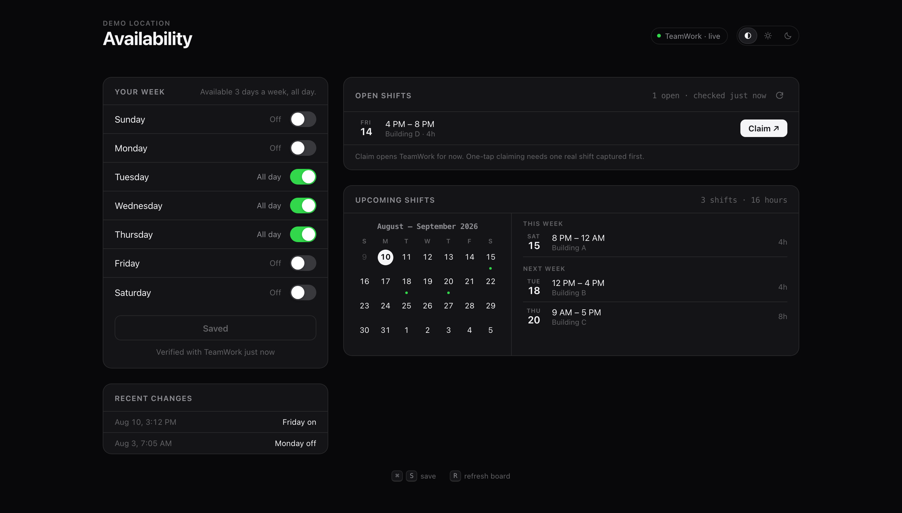

# RSO availability

Sets my weekly availability on TeamWork without opening TeamWork.

Also shows what is on the SwapBoard and what I am already rostered for. Runs locally, nothing hosted.



Screenshot uses dummy data.

## Setup

macOS and Node 18+. Details in PREREQUISITES.md.

```sh
git clone https://github.com/ameyyy7303/rso-availability.git
cd rso-availability
./install.sh
```

It asks three things.

**Employee number.** The same one you type into the TeamWork sign-in.

**Location and code.** Press enter for the defaults, `RSO Boston` and `Resident`.

**Password.** Your TeamWork password. It goes into the macOS Keychain. Not a file, not shell history.

Then open a new terminal and run `rso`.

Asked once. Never again.

Re-running `install.sh` is safe, it skips whatever is already done.

## Run it

```sh
rso
```

Opens http://127.0.0.1:8123. Ctrl+C stops it.

## What it does

Toggle days, hit save. Writes straight to TeamWork.

Saves are verified. It re-reads the template after writing and shows what TeamWork actually kept, so a silently rejected write cannot look like a success.

Open shifts refresh every minute while the page is open, 150s if the tab is in the background. Browser notification when something new lands. Close the tab and it all stops, there is no daemon.

Four week calendar of the shifts I already have, with an agenda next to it.

Warns me when a week has no shift booked, since I need one a week to keep the job, and when availability is sitting empty because TeamWork reset it. Both only show up when there is actually something to do.

The toggles are read live from TeamWork every minute, not cached locally. If TeamWork resets the week while the page is open, the page follows. It skips the refresh while I have unsaved edits so it cannot wipe what I am mid-way through.

Every save that changed something gets appended to `history.jsonl`.

Shortcuts: `⌘S` save, `R` refresh the board, `⌘\` cycle light/dark/auto.

## CLI

Same writes, no browser.

```sh
node avail.mjs            # dry run, shows the diff, submits nothing
node avail.mjs --submit   # save
```

Reads the week from `config.json`. Dry run is the default because this writes to a system my managers read.

Exits non-zero if the readback disagrees with what it sent.

## Changed your password?

```sh
security add-generic-password -U -s tmwork-rso -a YOUR_EMPLOYEE_NUMBER -w
```

`-U` updates the existing entry instead of erroring. `-w` with nothing after it makes macOS prompt, so it stays out of shell history.

## Notes

API notes and the list of what is not built yet: NOTES.md.

`config.json`, `history.jsonl` and `board-log.jsonl` are mine and gitignored. So is `recon-out/`, which holds captured traffic and a logged-in browser profile.
